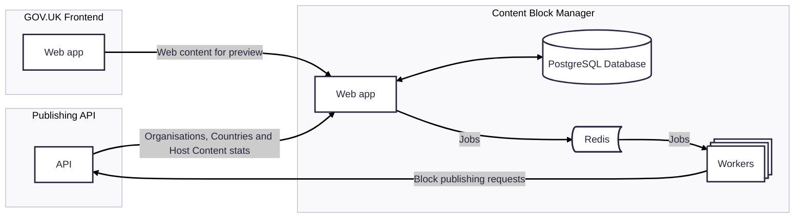

# Architecture

A basic outline of the architecture of Content Block Manager can be seen below:

```mermaid
---
config:
      theme: redux
---
flowchart LR
    subgraph Publishing API
        publishing-api[API]
    end

    subgraph "GOV.UK Frontend"
        frontend[Web app]
    end
    
    subgraph Content Block Manager
        app[Web app]
        redis@{ shape: bow-rect, label: "Redis" }
        workers@{ shape: processes, label: "Workers" }
        db[(PostgreSQL Database)]

        app<-->db
        app-->|Jobs|redis
        redis-->|Jobs|workers
        workers-->|Block publishing requests|publishing-api
        publishing-api-->|Organisations, Countries and Host Content stats|app
        frontend-->|Web content for preview|app
    end
    
```
