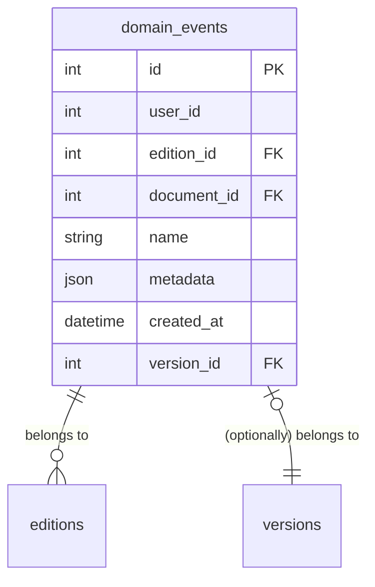

# 9. Use domain events to record edition history

Date: 2026-01-23

Status: Accepted

## Context

The Content Block Manager currently relies on the [`Edition::HasAuditTrail` concern][1] and the `Version` model to 
generate the history timeline for a block.

This approach records a callback when a non-draft edition is updated. To display the timeline, the system inspects 
the `Version` and attempts to derive context by looking at the associated Edition (`version.item`).

### The Problem

This architecture assumes the Edition's current state reflects the state at the time of the versioning. This causes two 
major issues:

1.  **Mutable State vs. Immutable History:** Relying on `version.item` (the current record) is brittle. For example, if 
an edition is "Scheduled" but then edited to be "Published" immediately, the `scheduled_publication` timestamp is 
cleared on the Edition. This causes the timeline history for the "Scheduled" event to error, as the data it relies on 
no longer exists.
2.  **Loss of Intermediate Context:** We cannot accurately track multiple cycles of the same state. If a block goes 
through multiple rounds of 2i or Factcheck, the `Version` only points to the *final* outcome stored on the Edition, 
losing the history of previous approvals or rejections.

Currently, we attempt to workaround this with logic like:

```ruby
def review_outcome
  return unless version.state == "awaiting_factcheck"

  # This relies on the current edition state, which may have changed since 
  # the version was created
  skipped_or_performed = version.item.review_skipped ? "skipped" : "performed"
  "2i review #{skipped_or_performed}"
end
```

## Decision

We will introduce a new `DomainEvent` model to explicitly record significant actions in an Edition's lifecycle. This 
decouples the **historical record** (what happened and when) from the **current state** (what the edition looks like now).

### Schema

A `DomainEvent` will capture the specific action (`name`) and a snapshot of relevant context (`metadata`) at the exact 
moment the event occurred.



*   **`name`**: A machine-readable string describing the action in the format `$object.$noun.$verb`.
For example, when sending to review, `name` will be `edition.draft.sent_to_review`, and when creating a new draft, `name` will be `edition.draft.created`
*   **`metadata`**: A JSON payload containing snapshot data relevant to that specific event (see [Metadata shape]).
*   **`version_id`**: An optional link. This allows us to maintain the existing `Version` functionality for tracking 
field-level data changes (diffs), while the `DomainEvent` handles the semantic timeline.

#### Metadata shape

The shape of metadata will depend on the action that has taken place. For example - **when a review has been performed**:
```json
{
  "review": {
    "performed_by": {
      "name": "Nigel Smith",
      "email": "nigel@example.com"
    },
    "recorded_by": {
      "name": "Ian Editor",
      "email": "editor@example.com"
    },
    "recorded_at": "2026-01-29 13:29"
  }
}
```
Ian is the logged in user, who has recorded that Nigel performed the 2i review.

And when a **fact check has been skipped**:
```json
{
  "fact_check": {
    "skipped_by": {
      "name": "Ian Editor",
      "email": "editor@example.com"
    },
    "skipped_at": "2026-01-29 13:29"
  }
}
```
Ian has recorded that he's skipped the fact check step.

Additionally, when an Event is tied to a Version, we should also record the previous state and the new state. For example,
when sending to review, the metadata should include:

```json
{
  "previous_state": "draft_complete",
  "new_state": "awaiting_review"
}
```

### Usage Example

When a fact-check is performed, we create an `DomainEvent`:
*   **Name:** `factcheck_performed`
*   **Metadata:** `{ "performed_by": "Jane Doe" }`

The UI can then render the description using `I18n` and the frozen metadata, without querying the Edition:

```ruby
# Pseudo-code
I18n.t(
  "events.edition.fact_check.performed",
  user: event.metadata["review"]["performed_by"]["name"],
  date: event.created_at
)
# => "Factcheck performed on 23 Jan by Jane Doe"
```

## Consequences

### Implementation

We will update the application to generate `DomainEvent` records for the following actions:

| action                                 | event name                           | associated version's state  |
|----------------------------------------|--------------------------------------|-----------------------------|
| Brand new block created                | `document.draft.created`             | -                           |
| New edition created for existing block | `edition.draft.created`              | -                           |
| Draft deleted                          | `edition.draft.deleted`              | -> `deleted`                |
| Draft completed                        | `edition.draft.completed`            | `draft` -> `draft_complete` |
| Draft sent to review                   | `edition.draft.sent_to_review`       | -> `awaiting_review`        |
| Review skipped                         | `edition.draft.review_skipped`       | -                           |
| Review performed                       | `edition.draft.review_performed`     | -                           |
| Draft sent to fact-check               | `edition.draft.sent_to_factcheck`    | -> `awaiting_factcheck`     |
| Fact-check skipped                     | `edition.draft.fact_check_skipped`   | -                           |
| Fact-check performed                   | `edition.draft.fact_check_performed` | -                           |
| Draft scheuled for publication         | `edition.draft.scheduled`            | -> `scheduled`              |
| Scheduled draft published              | `edition.schedule.executed`          | -                           |
| Draft block publihsed                  | `edition.draft.published`            | -> `published`              |

We will also modify the `has_audit_trail` concern to generate a `DomainEvent` alongside the existing `Version` when an 
edition is saved.

### Migration & Backfill

*   Existing `Edition`s must be backfilled. We will write a migration script to generate `DomainEvent` records based on
existing `Version` history.
*   **Note:** Perfect fidelity may not be possible for all historical actions where metadata was previously lost 
(e.g., overwritten 2i outcomes), but we will approximate based on available `Version` data.

### Presentation

*   The `TimelineItemComponent` will be updated to read from the `DomainEvent` stream rather than `Version` records.
*   During the transition period, we may need to support both sources until the backfill is verified.

[1]: https://github.com/alphagov/content-block-manager/blob/main/app/models/edition/has_audit_trail.rb
[Metadata shape]: #metadata-shape
