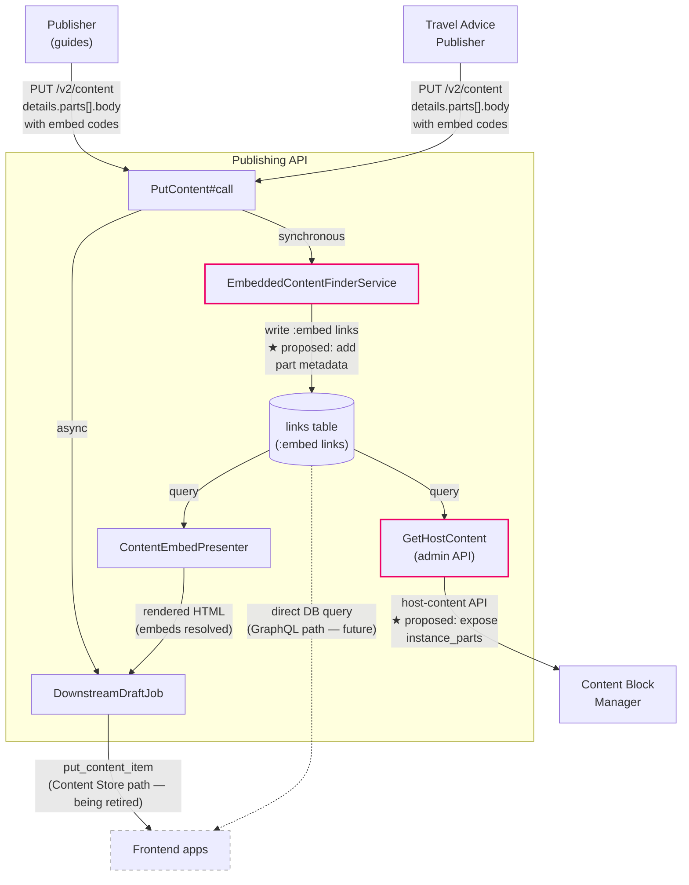

# 14. Track part location in Publishing API embed links

Date: 2026-06-17

Status: Draft

## Context

Content blocks can be embedded in multi-part GOV.UK guidance documents. The Publishing API tracks these relationships via `:embed` edition links, created by `EmbeddedContentFinderService` within `Commands::V2::PutContent` when a publishing app submits content via `PUT /v2/content/:id`. However, this tracking is at the **document level** only. We know that "Guide X  embeds Block Y" but not which specific parts of the guide contain the block.

This creates a poor user experience in the block preview engine: the `HostEditionsTableComponent` links to page 1 of the guide, but the content block may only appear on pages 2 and 4. 2i reviewers and fact checkers must click through parts manually to find where the block is used.

### Publishing apps which produce multi-part documents

Two publishing applications create documents with `details.parts`:

| App                                       | Model                              | Document type   | Storage                             |     |
| ----------------------------------------- | ---------------------------------- | --------------- | ----------------------------------- | --- |
| [Publisher][publisher-guide] (Mainstream) | `GuideEdition` (includes `Parted`) | `guide`         | PostgreSQL (separate `parts` table) |     |
| [Travel Advice Publisher][tap-edition]    | `TravelAdviceEdition`              | `travel_advice` | MongoDB (embedded documents)        |     |

Despite different internal storage mechanisms, both apps send an **identical payload structure** to Publishing API via `PUT /v2/content`:

```json  
{
  "details": {
    "parts": [
      {
        "slug": "how-to-apply",
        "title": "How to apply",
        "body": [
          { "content_type": "text/govspeak", "content": "..." }
        ]
      }
    ]
  }
}
```

Each part has a `slug` (URL segment), `title`, and `body` (an array of content objects with `content_type: "text/govspeak"`). The Govspeak content within `body` is where `{{embed:...}}` codes appear.

`EmbeddedContentFinderService` traverses this structure recursively: it descends through the `parts` array, into each part hash, and matches the `body` array against `[{ content_type: String, content: String }, *]` to extract the Govspeak for embed-code scanning. The proposed enhancement does not change this traversal: it **adds** tracking of which part each match was found in.

### Current architecture

```
Publishing App
  │
  │ PUT /v2/content/:id  (body includes details.parts[].body with embed codes)
  │
  ▼
Publishing API
  ├── EmbeddedContentFinderService.fetch_linked_content_ids(details)
  │     └── Scans ALL values in details (including parts) for {{embed:...}} patterns
  │     └── Returns flat list of content_ids
  │
  ├── PutContent#create_links
  │     └── Creates Link records: { link_type: "embed", target_content_id: <block_id> }
  │     └── No part/field metadata stored
  │
  └── GetHostContent query (admin API for CBM)
        └── Queries reverse :embed links
        └── Returns: base_path, title, instances (count), etc.
        └── No part-level information
```

### Why this is important

1. **Preview UX**: Reviewers cannot easily find where a block is used  
   within a multi-part guide. They land on page 1 and must navigate manually.

2. **Host editions table**: The document-level `instances` count tells  
   you the block appears N times in the guide, but not which parts.

3. **In-preview navigation**: The `base_path` parameter exists partly  
   to support navigating to specific parts, but without knowing which parts are relevant, the user gets no guidance.

4. **Block removal tracking**: Editors need to know when a content block is removed from a part, so they can verify the removal was intentional. With document-level tracking alone, we can detect that the instance count decreased (e.g. block appeared twice, now appears once) but cannot identify which part the block was removed from. Part-level metadata will allow a comparison of editions to identify exactly where usage was added or removed. This is a prerequisite for meaningful removal alerts. The full removal-notification feature (triggers, UI, rules) is out of scope for this decision but depends on the data model proposed here.

### Scope of `:embed` links

The `:embed` link type was introduced in [August 2024][pr-2813] as part of the [GraphQL for GOV.UK][rfc-172] programme of work. It is purpose-built for content blocks and is:

- **independent of legacy link expansion** (does not appear in
  `expansion_rules/link_expansion.rb`)
- **created exclusively** by `PutContent` via `EmbeddedContentFinderService`
- **consumed exclusively** by content-block-related code:
    - `GetHostContent` (CBM admin API)
    - `GetEmbeddedEditionsFromHostEdition` (GraphQL resolver)
    - `ContentEmbedPresenter` (rendering)
    - `UpdateStatisticsCacheJob` (statistics)
    - `ChangeHistory` (change notes)
- **isolated from any frontend app**: frontends receive rendered HTML from `ContentEmbedPresenter`

Adding metadata to `:embed` links affects only content-block consumers. Because all producers and consumers of `:embed` links reside in either Publishing API or Content Block Manager, the proposed enhancement can be delivered entirely through changes to these two applications. No changes are required to frontend apps, Content Store, or any other GOV.UK component.



The starred (★) items are the two points of change proposed in this decision. Frontend apps (dashed border) receive rendered HTML regardless of whether content reaches them via Content Store or GraphQL.

### Compatibility with GraphQL migration

These `:embed` links are created synchronously within `Commands::V2::PutContent#call` — i.e. when a publishing app submits content to Publishing API via `PUT /v2/content/:id`. This is distinct from the downstream push to Content Store (`Adapters::DraftContentStore.put_content_item`), which happens asynchronously via `DownstreamDraftJob`.

The GraphQL migration ([RFC 172][rfc-172]) eliminates the downstream Content Store push and link expansion, but does not change the `PutContent` command where `:embed` links are created. The `GetHostContent` admin API queries the database directly and is unaffected by whether the frontend uses Content Store or GraphQL.

## Decision

We will enhance the `:embed` link creation in Publishing API to record **which part(s)** of a multi-part document contain each embedded content block. Expose this metadata via the existing `host-content` admin API so that Content Block Manager can guide users to the relevant parts.

### Data model

We will extend the `Link` model to store part-level metadata for each embed occurrence.

The `links` table already creates one record per occurrence, not per unique `target_content_id`. If block `abc` appears in Part 2 and Part 4, two `Link` records are created (distinguished by `position`). Adding part metadata is a 1:1 enrichment of existing records.

#### Add JSONB metadata column on links table (recommended)

Each link record which refers to a multi-part document would record its part-location:

```json
{ "part_slug": "how-to-claim" }
```

For non-parted documents, `metadata` will be `{}`.

### Changes to EmbeddedContentFinderService

Currently `fetch_linked_content_ids` returns a flat list of content_ids. It will be enhanced to return structured data including the field path (e.g. `details.parts[2].body`) or part slug where each embed is found.

### Changes to GetHostContent API response

We will add an `instance_parts` property:

```json
{
  "host_content_id": "...",
  "base_path": "/guidance/income-tax",
  "instances": 2,
  "instance_parts": [
    { "slug": "rates", "title": "Rates" },
    { "slug": "how-to-claim", "title": "How to claim" }
  ]
}
```

### Changes to Content Block Manager

- `HostContentItem` model will use `instance_parts` field
- `HostEditionsTableComponent` will display which parts contain the block
- Preview engine will use `instance_parts` to render navigation aids   guiding reviewers directly to the relevant parts

## Consequences

### Benefits

- 2i reviewers / fact checkers will be able to navigate directly to parts containing the content block, rather than clicking through manually
- The host editions table can show "Used in: Rates, How to claim" alongside each host document
- No request-time cost: metadata will be computed at publish time
- Future-proof: works identically under both Content Store and GraphQL

### Costs

- Requires a Publishing API change
- Requires a migration to add metadata storage to the links table
- `EmbeddedContentFinderService` will become slightly more complex, to
  track position as well as identity
  republished (but this already happens — `:embed` links are
  recreated on every `put-content`)

## References

- [`GuideEdition` in Mainstream Publisher][publisher-guide]
- [`TravelAdviceEdition` in Travel Advice Publisher][tap-edition]
- [Introduction of the `:embed` link at Publishing API: PR 2813][pr-2813]
- [RFC 172: GraphQL for GOV.UK][rfc-172]


[publisher-guide]:
https://github.com/alphagov/publisher/blob/bb917b2f386394e61bb70922b32d1d9dd76e48ad/app/models/guide_edition.rb#L5

[tap-edition]:
https://github.com/alphagov/travel-advice-publisher/blob/07cfbab157aab3172d3f99920392e0c4270b1a94/app/models/travel_advice_edition.rb#L50

[pr-2813]:
https://github.com/alphagov/publishing-api/pull/2813

[rfc-172]:
https://github.com/alphagov/govuk-rfcs/blob/6b1379652139e3fac405c4d751ca21bc4cc846cc/rfc-172-graphql-for-govuk.md