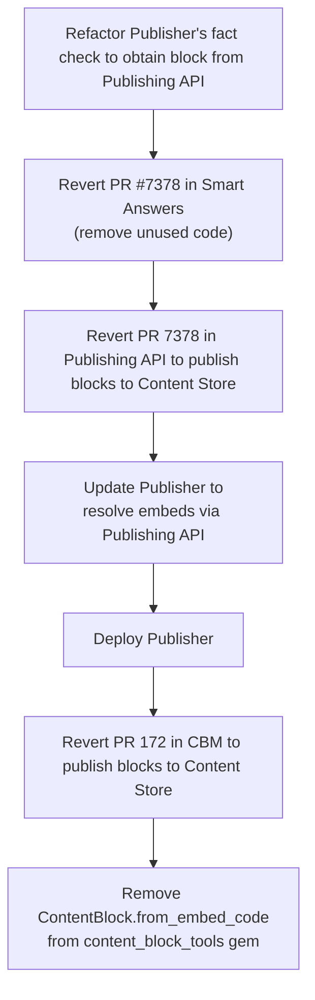

# ADR 15: Remove dependence on base_path

Date: 2026-07-07

Status: Accepted

## Context

[RFC-192: Restrict base_paths to a smaller character set][RFC-192] proposes restricting GOV.UK base paths to `a-z 0-9 . / -` (no underscores, no uppercase). Content blocks are affected because their `base_path` includes the `document_type` (e.g. `content_block_time_period`) which contains underscores, as in this `base_url`:

```
"/content-blocks/content_block_time_period/tax-year"
```  

Base paths aren't stored. They are generated when needed in two code locations:

1. **CBM** `ContentBlockPresenter#base_path` — used when publishing
2. **content_block_tools** `ContentBlockReference#content_store_identifier` — used by Publisher and Smart Answers to fetch blocks from Content Store

### Scope of underscore restriction

RFC 192 has consequences only for the `base_path`, which is required to lodge content in the Content Store. Other uses of the underscore which remain unaffected include:

- the `document_type` itself
- the inclusion of `document_type` in the compound `content_block_{block_type}` segment of an embed code (e.g. `{{embed:content_block_time_period:tax-year}}`)

### Where the base_path is used

The `base_path` is important in two scenarios. In both cases the "tools" gem's `ContentBlockTools::ContentBlock.from_embed_code(embed_code)` is used to retrieve a block from Content Store. It uses `ContentBlockTools::ContentBlockReference#content_store_identifier` to construct the `base_url` in a way similar to that used in Content Block Manager's `ContentBlockPresenter#base_path` when publishing to the Publishing API:

```rb
# ContentBlockTools::ContentBlockReference
def content_store_identifier
  "/content-blocks/#{document_type}/#{identifier}"
end
```

The two scenarios in more detail:

#### 1. Publisher renders a block for fact checking

Publisher's `EditionsController#send_to_fact_check` renders embed codes via the Content Store:

```
EditionsController#send_to_fact_check
  → FactCheckRequestForm.new(edition:, user:)
    → presenter.render_for_fact_check_manager_api
      → HtmlRenderer.render_html(body)
        → Govspeak::Document.new(body).to_html
        → ContentBlockReference.find_all_in_document(html)
        → ContentBlock.from_embed_code(code).render
```

NB: this is the part of the new "Fact Check Manager" flow being added to Publisher.

#### 2. Smart Answers records embed links (unused)

When publishing content, the Smart Answers publishing app uses a `ContentBlockDetector` to find embed codes and retrieve the corresponding blocks from Content Store in order to publish their `content_id`s as "embed links". This allows Content Block Manager to identify the appropriate Smart Answer content when building a list of locations where the block is used ([`HostContentItems`][host_content_items])

NB: this code was added to Smart Answers in the proof of concept [PR 7378][smart_answers_pr_7378]. It's important to note that:

- currently no Smart Answer content uses a content block

- there's currently no clear evidence to support the belief that smart answers are a good candidate for re-useable content blocks. In fact, from discussions with developers of the system, we currently believe that Smart Answers are a poor use case for content blocks.

### Why base_path is redundant

Neither of the current use-cases of `base_path` is required:

- Publisher can obtain the block from Publishing API using the block's `content_id_alias` (`ContentBlockTools::ContentBlockReference#identifier`)
- Simple Answers do not currently use blocks and there's no clear use case for that at present

The most code-efficient strategy to becoming RFC-192 compliant is to remove the need to continue to support `base_path`s at all.

## Decision

We'll remove the dependencies on Content Store which exist through the tools gem's `ContentBlock.from_embed_code`. We'll then go on to remove the requirement for `base_path` by no longer publishing blocks to the Content Store.

Content blocks were added to Content Store purely to support Smart Answers which is no longer a current use-case. The refactoring of content blocks' `base_path` has revealed that supporting the retrieval of blocks from Content Store is a false requirement.
### 1. Refactor Publisher's fact check to obtain block from Publishing API

We'll alter the `HtmlRenderer.render_html(body)` method to use `ContentBlockTools::ContentBlock.new(details)` instead of `ContentBlockTools::ContentBlock.from_embed_code(embed_code)`. Rather than the tools gem retrieving the content block from the Content Store, Publisher will need to fetch the block from the Publishing API. Something like:

```rb
class HtmlRenderer
  def self.render_html(document)
    html = Govspeak::Document.new(document).to_html
    references = ContentBlockTools::ContentBlockReference
                   .find_all_in_document(html)
    references.each do |ref|
      block = fetch_from_publishing_api(ref)
      html.gsub!(ref.embed_code, block.render)
    end
    html
  end

  def self.fetch_from_publishing_api(reference)
    response = Services.publishing_api.get_content_items(
      content_id_aliases: [reference.identifier],
      document_type: reference.document_type,
    ).to_h.dig("results", 0)
    ContentBlockTools::ContentBlock.new(
      content_id: response["content_id"],
      title: response["title"],
      document_type: response["document_type"],
      details: response["details"],
      embed_code: reference.embed_code,
    )
  end
end
```

### 2. Remove Content Block support from Smart Answers

As no Smart Answers use content blocks we can safely revert [Smart Answers PR 7378][smart_answers_pr_7378].

### 3. Remove ContentBlock.from_embed_code

We can then remove the `ContentBlock.from_embed_code` method entirely from the "tools" gem.
### 4. Stop publishing content blocks to Content Store

There will then be no reason to continue to publish blocks to the content store.


### Migration plan


## Consequences

The mechanism for rendering blocks from their embed codes will be simplified. Only `ContentBlockTools::ContentBlock.new().render` will be offered.

Rather than relying on the "tools" gem to fetch a block from Content Store using its `base_path`, callers such as Publisher will need to obtain a JSON representation of the block they wish to render from the Publishing API using `GdsApi::PublishingApi`, e.g:

```rb
Services.publishing_api.get_content_items(
  content_id_aliases: [reference.identifier],
  document_type: reference.document_type,
)
```

The hypothetical requirement to support public retrieval of blocks which was introduced by [Smart Answers PR 7378][smart_answers_pr_7378] will be removed.

We will stop publishing content blocks to the Content Store by reverting [CBM PR 172: Publish content blocks to content store][cbm_pr_172] and  [Publishing API PR 3688: Publish content blocks to Content Store][publishing_api_pr_3688] as there is currently no use case for offering blocks through this public API. At Content Block Manager, we are now offering an API for discovering and rendering Content Blocks, see [ADR 13: Add API to Content Block Manager][adr13_cbm_api] and this API could serve the blocks to Smart Answers if that use case were to be established in the future.


## References

- [RFC-192: Restrict base_paths to a smaller character set][RFC-192]
- [Smart Answers PR 7378: an unused proof of concept which adds a false dependency][smart_answers_pr_7378]
- [`HostContentItem` for building a list of content using a block][host_content_items]
- [CBM PR 172: Publish content blocks to content store][cbm_pr_172]
- [Publishing API PR 3688: Publish content blocks to Content Store][publishing_api_pr_3688]
- [CBM ADR 13: Add API to Content Block Manager][adr13_cbm_api]

[host_content_items]:
https://github.com/alphagov/content-block-manager/blob/6225b320db8d1d035ab5f750e431fdc24cc39bce/app/public/models/host_content_item.rb#L18-L25

[RFC-192]:
https://github.com/alphagov/govuk-rfcs/pull/192/

[smart_answers_pr_7378]:
https://github.com/alphagov/smart-answers/pull/7378/

[publishing_api_pr_3688]:
https://github.com/alphagov/publishing-api/pull/3688

[cbm_pr_172]:
https://github.com/alphagov/content-block-manager/pull/172

[adr13_cbm_api]:
https://github.com/alphagov/content-block-manager/blob/797a30e46853ab9266293343241a77e15c0c6a0c/docs/architecture/decisions/0013-add-an-api-for-content-block-manager.md