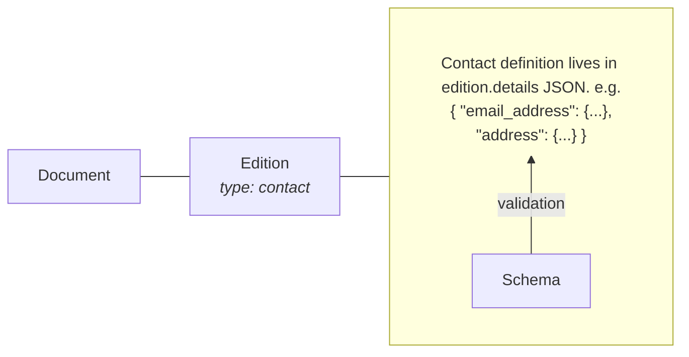
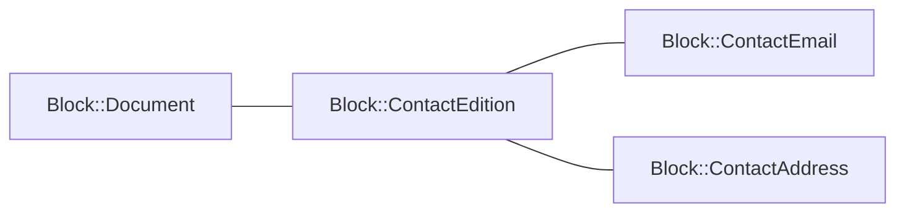
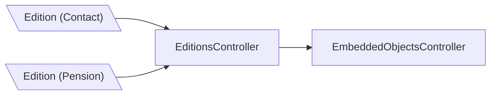
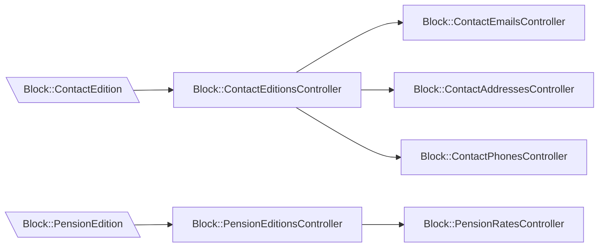

# 16. Store Content Blocks as ActiveRecord Models

Date: 2026-07-06

Status: Accepted

## Context

The Content Block Manager started with a schema-driven architecture built around a generic `Document` model, a generic
`Edition` model, and a `details` JSON column. That approach gave us flexibility when block schemas were defined outside
this application, but it also made the code harder to understand and change as block types became more specialised.

## Our Previous Experiment

We ran an experiment to test whether a more traditional Rails approach would be a better fit, [Experiment with
Traditional ActiveRecord Models for Content Blocks][]. The experiment used `TimePeriod` as a proof of concept and
explored modelling block data with explicit Rails models, associations, typed columns, and conventional 
validations.

The experiment was successful. It showed that the ActiveRecord approach gives us:

- clearer data structures and relationships
- simpler validation, especially for block-specific behaviour
- more straightforward forms and controllers
- tests that are easier to understand and maintain
- lower cognitive load when adding features, fixing bugs, or introducing new block types

The generic schema-driven approach was flexible but maintainability and clarity are more important.

For more information on what was involved in that experiment, see [ADR for ActiveRecord Experiment][].

## Decision

We will move to using the traditional ActiveRecord approach for modelling content blocks.

For new block types (and for existing block types when we choose to migrate them) we will prefer:

- explicit Rails models and associations over storing block-specific structure in a generic `details` hash
- typed database columns and dedicated tables where they make the domain clearer
- standard Rails validations and form objects/controllers over schema-driven generic behaviour where practical
- reuse of existing concerns and shared workflow behaviour, but without forcing block-specific requirements into a fully
  generic model

We will adopt this incrementally rather than through a single migration of the entire application. Existing block
implementations can remain in place until we have capacity to move them. As discussed below, models being migrated to
the new approach will be namespaced away from the existing work and can live on separate URLs, meaning we can
incrementally migrate models across without disturbing existing customer UX.

## Architecture

### Namespace

All new code will live in the `Block::` namespace to run parallel with the existing system. This means we can begin to
create a `Block::Edition` alongside the existing `Edition` whilst we migrate things over. We could optionally look at
removing this namespace once the refactoring work is complete, if it feel like there's value.

### Key Architectural Choices

These are outlined in more detail here [ADR for ActiveRecord Experiment][] so this is merely a summary of what we agreed
as part of the previous experiment.

#### 1. Document Model (No STI)

`Block::Document` is a **single concrete class** (no Single Table Inheritance). It can have a `block_type` column to
track which type it uses.

#### 2. Edition Model (STI)

`Block::Edition` uses **Single Table Inheritance** where a `type` field denotes the edition subtype. e.g. 
`Block::TaxEdition`.

#### 3. Content in Specialized Tables

Each edition type has its own dedicated content tables with typed columns. For example a `Block::ContactEdition` may
have a `Block::ContactEmail` and multiple `Block::ContactTelephoneNumber`.

#### 4. No Generic Details Column

Instead of a `details` JSON column each edition subclass will implement a `#details` method that serializes from its
associated content models.

#### 5. Two-Controller Pattern for Multi-Step Forms

Rather than use general-purpose multi-step "wizard" code (`Workflow`) we can use separate controllers for different form
steps, for example one for common fields and one for type-specific fields. This should give us more control over the
user experience.

#### 6. Shared Fields on Base Table

Fields common to all block types live on `Block::Edition` (`block_editions` table), e.g. `description`, `title`.

### Illustration

#### Models

To give a concrete example of how this might present itself in the new architecture, take the example of a Contact block
in both the old and new architectures and how their structure might differ:

**Current**


(Demonstrating that currently an all-purpose `Edition` (with a `type`) belongs to a `Document` and the definition of the
`Edition` lives in the `details` of said edition.)


**Proposed**

(Demonstrating that the proposed solution will have a specifc `ContactEdition` and the values stored inside will have
their own ActiveRecord models, `ContactEmail` and `ContactAddress` in this case.)

As you can see here, rather than having the bulk of the definition of the Contact block stored in JSON inside an
`Edition`, we split these values out into their own concrete models. This should give us all the power of using Rails
ActiveRecords when storing this information, and allow us to remove a lot of custom code that handles the parsing and
validation of the current JSON values. This also means that we can remove the Schema altogether.

Also, note that we use STI to subclass `Block::Edition` into discrete subtypes. This means we can customise the
behaviour of an individual `Block::Edition` subtype without affecting other `Block::Edition` subtypes.

#### Controllers

Similarly, we can compare the previous architecture regarding Controllers and how it differs in the new approach. In
this example we can compare how currently we share responsibilities between generic Controllers and in future we will
write individual Controllers for each model.

**Current**

(Demonstrating multiple Editions being handled by a small number of Controllers)


**Proposed**

(Demonstrating individual Controllers per Edition subtype and child model)

As you can see here, whether we're handling an `Edition` which happens to be a `Contact` or a `Pension`, the Controllers
are the same. The current implementation appears to have fewer moving parts and is able to handle multiple models.
However, in reality this means that the code that handles this behaviour ends up being complicated and difficult to
understand for developers. Moving to an architecture where different kinds of Edition have their own code means that we
can be much more specific. Code no longer needs to be able to handle a large number of possible cases. This will help
reduce complexity.

### Data Migration

Once an existing model has been migrated to the new approach, we will need to migrate the data from the existing
database tables into the new structure. At time of writing this only applies to Pensions and Contacts as these are the
only blocks being used in production currently.

None of this work is attempting to change the values stored for our blocks and this change should be invisible to the
end users.

## Consequences

### Benefits

- The codebase should be easier to reason about because the shape of each block type is expressed directly in models and
  tables. We currently rely on schemas to denote a lot of behaviour in the system and the code that operates on this can
  be hard to understand. We currently use a lot of custom schema properties to define behaviour e.g.
```json
    "contact_links": {
      "type": "object",
      "additionalProperties": false,
      "patternProperties": {
        "^[a-z0-9]+(?:-[a-z0-9]+)*$": {
          "type": "object",
          "required": ["label", "url"],
          "additionalProperties": false,
          "x-embeddable-as-block": true,
          "x-group": "contact_methods",
          "x-group-order": 4,
          "x-block-display-fields": ["url", "label", "description", "title"],
          "x-field-order": ["title", "label", "url", "description"],
          "properties": {
             "description": {
               "x-component-name": "textarea",
               "x-govspeak-enabled": true
               ...
```
- Block-specific changes should be faster to implement because they no longer need to fit into a heavily generic
  abstraction.
- Validation should become more explicit.
- Future maintenance should be less risky because behaviour is easier to trace through conventional Rails patterns.
- Iteration should be faster as we're dealing with less complexity. This should allow us to meet users needs sooner.

### Trade-offs

- Adding new models will mean writing migrations, models, views and controllers and not just a schema.
- Schema changes will usually require database migrations rather than only configuration changes.
- During the transition, the codebase will contain both generic and ActiveRecord-led approaches at the same time.

### Implementation direction

1. Migration of existing blocks should happen incrementally and we will begin immediately.
2. New work should prefer explicit ActiveRecord-backed models.
3. We should continue to preserve external behaviour and API contracts while changing the internal representation.

[ADR 10 Make Content Block Manager the source of truth for schemas]: ./0010-make-content-block-manager-the-source-of-truth-for-schemas.md
[Experiment with Traditional ActiveRecord Models for Content Blocks]: https://github.com/alphagov/content-block-manager/pull/553/
[ADR for ActiveRecord Experiment]: ./experiments/0001-experiment-with-traditional-activerecord-models.md
