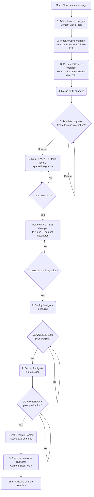

# Changing the structure of a content block

If you need to change the structure of a content block, you will need to coordinate your changes across the CBM repo, the GOVUK E2E test repo, the Content Reuse E2E test repo, as well as running any relevant data migrations in each environment. You may also need to introduce defensive changes to Content Block Tools and CBM so ensure that both the legacy and the new data structures can be accommodated adequately whilst the changes are in flight.

## The step by step process

1. Introduce defensive changes to Content Block Tools to accommodate both the legacy and the updated data structure. For example, in changing the pension amount data structure, you would need to ensure that the Content Block Tools pension presenter renders the block correctly whether the legacy or the updated data structure is passed in. This will protect the experience of users of Mainstream and Whitehall, as well as users of GOV.UK.
2. Prepare your changes to CBM, i.e. the substantive changes to the data structure and related changes. They should also include a Rake task for the corresponding data migration.
3. Prepare your changes to the Content Reuse E2E test and GOVUK E2E test repos. If you are able to, run these tests locally against your local changes to CBM after migrating the data locally. If not, prepare the changes you think are necessary to these repos, and create draft PRs based on these changes. You will then need to run the tests locally against the changes in integration, once the CBM changes have been merged and the data migrated.
4. Merge your changes to CBM. Monitor the progress of the deployment to integration in Argo Workflows. If your changes are covered by the GOVUK E2E tests, they should fail at this stage (because the data has not yet been migrated).
5. Run the Rake task migrating the data in integration. On success, "resubmit" the GOVUK E2E test task in Argo Workflows.
6. When the GOVUK E2E tests pass, the deployment should be promoted to staging. You can either wait for the GOVUK-E2E tests to fail in staging and repeat stage 5, or run the Rake task migrating the data in staging as soon as the initial deployment succeeds and you have a pod in staging with the Rake task available.
7. Repeat step 6 for the production environment.
8. Test your local changes to the Content Reuse E2E test repo against integration. Once they pass, merge these changes.
9. Remove the defensive changes introduced in step 1 to accommodate both legacy and updated data structures in Content Block Tools.

The team is currently considering ways to make this process simpler and more manageable.
