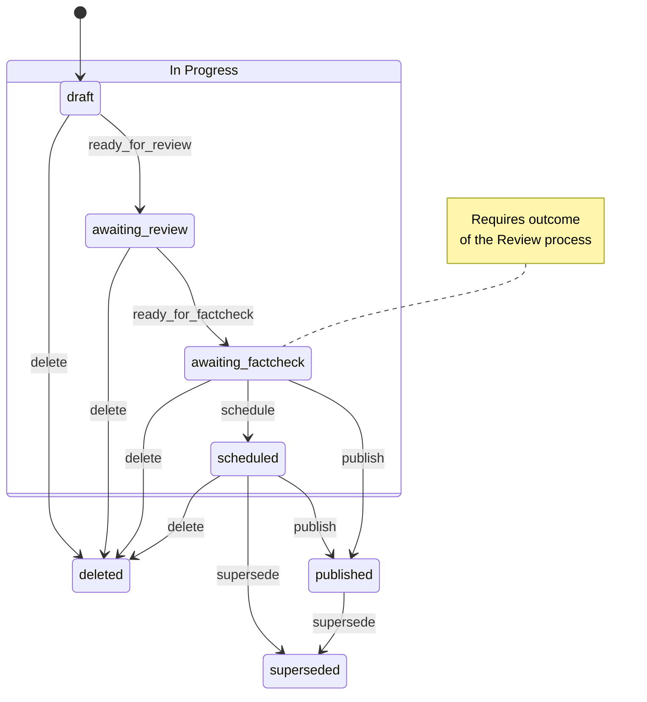

# Edition States

## State Diagram

## Notes

There are no backwards transitions in this model. If a user makes edits to a Published or Scheduled Edition, we
simply create a new Edition in the default (`draft`) state.

A user may propose a schedule for an edition in any state before `scheduled` or `published`. Once the Edition has
undergone all the review stages, it will be scheduled for publication. This means, for example, that a user may propose
a schedule for an Edition in the `draft` state but the state itself does not change.

## States

### draft

The default state for a new edition when created.

### awaiting_review

Once the author has completed their work, they can request that a 2i Review (second pair of eyes) be performed.

### awaiting_factcheck

Once the 2i Review has been completed, the author can request that a fact check be performed.
This is usually done by a Subject-Matter Expert.

### scheduled

Once the Edition has gone through the whole review process, it can be scheduled for publication.

### published

Once the Edition has been published, it is no longer editable. Moving an Edition to this state pushes it live for users.

### superseded

When a user makes an edit to a Scheduled or Published Edition, the original Edition is marked as superseded.

### deleted

When a user deletes an Edition, it is marked as deleted. Rather than having a `deleted_at` column, we use a `state`.
This allows us to easily restrict which states allow deletion and follows conventions set by other publishing apps.

An Edition in any in-progress state should be deletable. Once an Edition has been deleted, the associated Edition for a
Document should become the most recent non-deleted Edition in the document, if one exists.

## Transitions

### ready_for_review

Mark an Edition as ready for 2i Review.

### ready_for_factcheck

Mark an Edition as ready for fact check.

### schedule

Schedule an Edition for publication.

### publish

Publish an Edition to the Publishing API.

### delete

Delete an Edition.

## In Progress

Several places in our application, we found ourselves needing to refer to the set of states that represent an Edition
which isn't yet published and also hasn't been discarded in some way. To make this easier, we have defined a composite
state `In Progress` which includes the states:

- draft
- awaiting_2i
- awaiting_factcheck
- scheduled

This allows us to refer to `In Progress` in our state machine transitions and guards, improving readability and intent.

For example, when deciding whether or not an Edition is eligible for deletion we simply check if the Edition is `In
Progress`. It would be harmful to allow a user to delete an Edition which is published and would be redundant to allow
them to delete something which has already been deleted or superseded.
